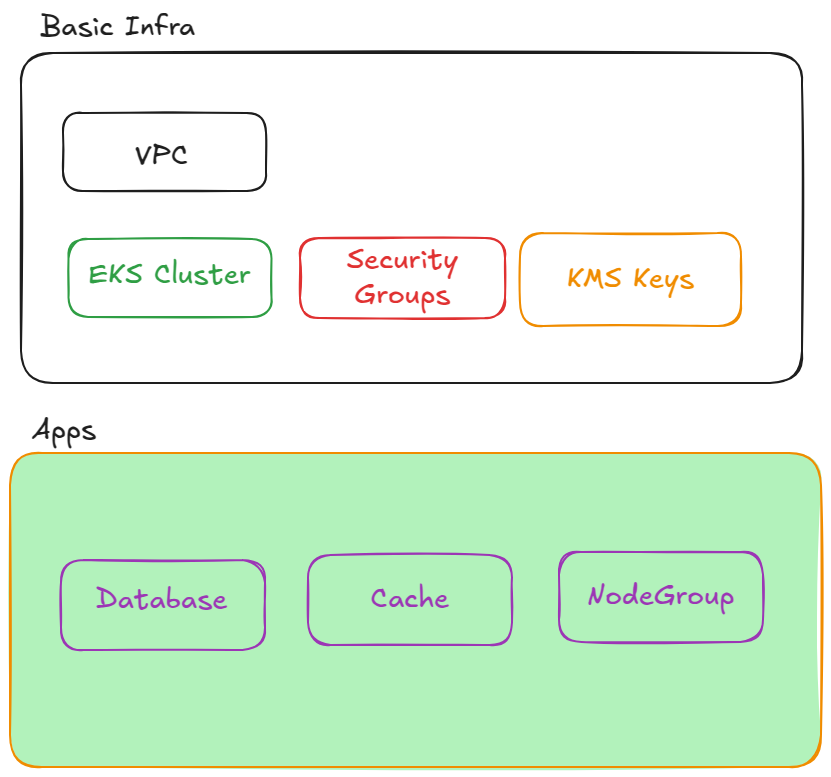
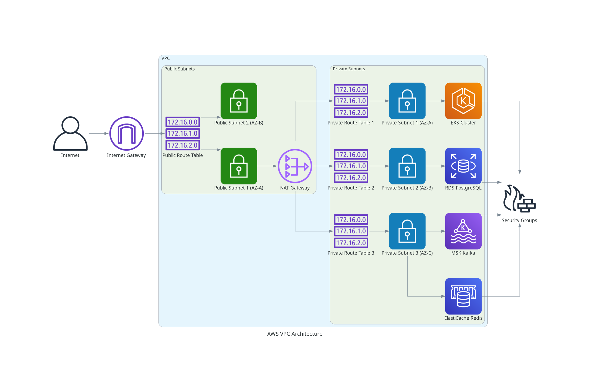

# Infrastructure as Code for Microservices Application - AWS EKS  

  

# AWS VPC Architecture  

This diagram represents the AWS network infrastructure.  

  

## 1. Cloud Platform Choice: AWS (Amazon Web Services)  

I decided to go for AWS since I have more experience with its services.  

## 2. Architecture Design Choices  

The architecture is designed with the following key principles:  

*   **Shared Infrastructure:** Networking (VPC, Subnets, NAT Gateway) and EKS cluster are envisioned as shared infrastructure components, potentially managed and provisioned separately. Applications can then be deployed into this shared environment, reusing these resources.  
*   **Modularity and Reusability:** Terraform code is structured into modules for better organization, reusability, and separation of concerns. Modules are defined for Networking, EKS, KMS, Database, Cache, Messaging, and Security Groups.  
*   **Configuration Driven by YAML:** Application-specific and infrastructure configurations are managed through YAML files, allowing for easy customization and deployment of different application environments.  
*   **Security Best Practices:**  
    *   **Private Subnets:** Application components (EKS worker nodes, databases, caches, message queues) are deployed in private subnets, without direct internet access.  
    *   **NAT Gateway:** Outbound internet access for private subnets is provided via a NAT Gateway in a public subnet.  
    *   **Security Groups:** Security Groups are used extensively to control network traffic to each resource, following the principle of least privilege.  
    *   **KMS Encryption:** Data at rest for RDS PostgreSQL, ElastiCache Redis, and MSK Kafka, as well as EKS secrets, is encrypted using AWS KMS Customer Managed Keys (CMKs). A dedicated KMS module manages the CMKs.  
    *   **Secrets Management:** Database credentials (username and password for RDS PostgreSQL) are securely generated and stored in AWS Secrets Manager.  

## 3. Assumptions  

*   **AWS Account and Credentials:** It is assumed that you have a configured AWS account and AWS credentials are set up for Terraform to authenticate. (Here you can use [yawsso](https://github.com/victorskl/yawsso) to extract credentials from a role).  
*   **Terraform Installation:** Terraform is installed and configured on your local machine.  
*   **YAML Configuration Files:** Configuration for each application (e.g., `app1`, `infra_mgmt`) is provided in separate YAML files within the `config/` directory.  
*   **Shared Networking and EKS (Optional):** The design supports reusing existing Networking and EKS infrastructure. If reusing, you must provide the correct IDs of existing VPC, subnets, and EKS cluster in the YAML configuration under the `existing_infrastructure` section. If creating new infrastructure, the YAML should specify `reuse_infrastructure: false` and provide the necessary configuration for Networking and EKS.  
*   **Security Groups:** Security Group rules are defined to allow necessary traffic based on the principle of least privilege. These rules may need further hardening in a production environment based on specific application security requirements.  
*   **KMS Customer Managed Keys (CMKs):** CMKs are used for encrypting sensitive data at rest. The code creates CMKs and manages their policies. In a production environment, review and customize the KMS key policies and consider key rotation strategies.  
*   **Secrets Management (AWS Secrets Manager):** Database credentials for RDS PostgreSQL are managed using AWS Secrets Manager. The Terraform code will automatically create a secret, generate a password, and retrieve it during database creation.  
*   **Monitoring and Logging:** Comprehensive monitoring and logging are essential for production deployments but are not explicitly configured in this Terraform code example. Consider integrating services like CloudWatch, CloudTrail, and Kubernetes monitoring tools in a production setup.  

## 4. Terraform Code Structure  

The Terraform code is organized into modules for better structure and reusability:  

*   `config/`: Contains YAML configuration files (e.g., `app1.yaml`, `infra_mgmt.yaml`).  
*   `kms/`: Defines and manages KMS Customer Managed Keys (CMKs) for encryption.  
*   `networking/`: Defines and manages the VPC, subnets, Internet Gateway, NAT Gateway, and Route Tables.  
*   `compute/eks/`: Defines and manages the EKS cluster and worker nodes.  
*   `database/`: Defines and manages the RDS PostgreSQL instance.  
*   `cache/`: Defines and manages the ElastiCache Redis cluster.  
*   `messaging/`: Defines and manages the MSK Kafka cluster.  
*   `security_groups/`: Defines all Security Groups used in the infrastructure.  
*   Root directory: Contains the root `main.tf`, `variables.tf`, `outputs.tf`, and `provider.tf` files, which orchestrate the deployment, load configuration from YAML, and define provider settings.  

## 5. How to Deploy  

1.  **Prerequisites:**  
    *   AWS Account configured.  
    *   Terraform installed (version 0.13 or later recommended).  
    *   AWS CLI configured (for Terraform to authenticate with AWS).  
2.  **Clone the repository** containing the Terraform code.  
3.  **Navigate to the root directory** of the Terraform code.  
4.  **Initialize Terraform:**  
    ```bash  
    terraform init  
    ```  
5.  **Review and Customize Configuration:**  
    *   **YAML Files in `config/`**: Review and customize the YAML configuration files (e.g., `config/app1.yaml`, `config/infra_mgmt.yaml`) according to your needs.  
        *   **Important:** If reusing existing Networking or EKS, update the `existing_infrastructure` section in the YAML with the correct IDs.  
        *   **Replace placeholder values** in YAML files (e.g., VPC IDs, subnet IDs, EKS cluster name). You no longer need to set database credentials in the YAML; they are managed by Secrets Manager.  
    *   **Variables in `variables.tf` (root module):** Review and customize root-level variables like `aws_region` if needed.  
6.  **Deploy Infrastructure (Example for `app1` application):**  
    To deploy using the `infra_mgmt.yaml` configuration (for initial Networking and EKS setup):  
    ```bash  
    terraform workspace new infra_mgmt || terraform workspace select infra_mgmt
    terraform plan -var="app_name=infra_mgmt"  
    terraform apply -var="app_name=infra_mgmt"  
    ```  
    ```bash  
    terraform workspace new app1 || terraform workspace select app1
    terraform plan -var="app_name=app1"  
    terraform apply -var="app_name=app1"  
    ```  
    To verify your workspaces:
    ```bash
    terraform workspace list
    ```
    To change workspaces:
    ```bash
    terraform workspace select infra_mgmt  # Switch to infra_mgmt
    terraform workspace select app1        # Switch to app1
    ```

## 6. Outputs  

After successful deployment, Terraform will output important information:  

*   `eks_cluster_name`: Name of the deployed EKS cluster (or name of reused EKS cluster if reusing).  
*   `rds_postgres_endpoint`: Endpoint of the RDS PostgreSQL instance.  
*   `rds_postgres_cluster_endpoint`: Cluster endpoint (address:port) of the RDS PostgreSQL instance. **(NEW OUTPUT)**  
*   `elasticache_redis_endpoint`: Endpoint of the ElastiCache Redis cluster.  
*   `msk_cluster_brokers`: Bootstrap brokers string for the MSK Kafka cluster.  
*   `vpc_id`: ID of the VPC.  
*   `private_subnet_ids`: List of Private Subnet IDs.  

These outputs can be used to configure your microservices applications to connect to the deployed infrastructure. **Note the new `rds_postgres_cluster_endpoint` output, which provides the full address and port for database connections.**  

## 7. Important Notes and Considerations  

* First of all, as an important note, I used AI to generate some of the code to be able to deliver this on time.  
* Some things should be included here, like CloudWatch logs for everything and CloudWatch Insights for the EKS cluster using the Addon.  
* The Terraform state should be stored in a combination of DynamoDB and S3 at least.  
* Some cost optimization may be possible—perhaps using SQS and SNS instead of the expensive MSK.  
* For databases, it's a good practice to change the default ports.  
* Better Security Group creation with more specific rules should be taken into account.  
* The EKS Cluster can take a lot to destroy since it has lifecicle policie attach in the autoscaling group.
